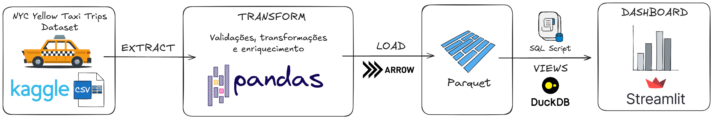
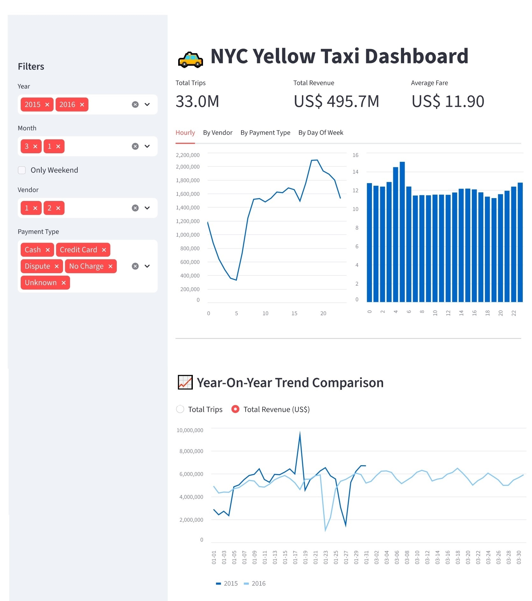

# NYC Yellow Taxi Data Analytics & Engineering

Projeto de Engenharia de Dados focado na construção de um pipeline ETL para dados de corridas do NYC Yellow Taxi através de milhares de registros com persistência em Parquet, processamento em DuckDB e dashboard interativo com Streamlit.

---

## 📖 Visão Geral
O projeto tem como objetivo construir um fluxo ETL completo usando dados reais de NYC Yellow Taxi.
O pipeline abrange desde a ingestão dos dados brutos até a disponibilização de *insights* visuais.
* Os arquivos originais passam por limpeza e tipagem, sendo persistidos em formato **Parquet** localmente para garantir alta compressão e otimização de leitura.
* O motor de processamento analítico (OLAP) é o **DuckDB**, que roda inteiramente em memória e executa consultas SQL complexas diretamente nos arquivos colunares, eliminando a necessidade de um banco de dados tradicional pesado.
* Por fim, os dados processados são consumidos sob demanda por um dashboard interativo desenvolvido em **Streamlit**, utilizando técnicas avançadas de caching para garantir performance em tempo real.

---

## 🏗️ Arquitetura do Pipeline



**1. Extração**
- Dados brutos extraídos do Kaggle em formato CSV.

**2. Validações, Transformações e Enriquecimento**
Etapa executada com Pandas:
* **Validações**: remoção de nulos e duplicatas, aplicação de filtros de anomalias;
* **Transformações**: conversão de tipos e tratamento de strings;
* **Enriquecimento**: criação de novas colunas que alimentam filtros no dashboard.

**3. Persistência em Parquet**
- Utilização do PyArrow para serializar os dados e salvar em Parquet, permitindo a leitura otimizada pelo DuckDB.

**4. Análise e Visualização**
- Os dados em Parquet são consultados utilizando DuckDB;
- Utilização de scripts SQL para criar Views analíticas que alimentam o dashboard construído com Streamlit.

---

## 🛠️ Stack Tecnológica
*   **Linguagem principal:** Python
*   **Manipulação dos dados:** Pandas
*   **Serialização para leitura otimizada:** PyArrow
*   **Ambiente:** Jupyter Notebook (conexão via ipykernel)
*   **Persistência:** Parquet
*   **Banco de Dados Analítico:** DuckDB
*   **Visualização:** Streamlit

---

## 📁 Estrutura do Projeto

```text
├── data/
│   └── raw/
│       └──.csvs
│   └── processed/
│       └── yellow_taxi_dataset.parquet
├── notebooks/
│   └── main.ipynb
├── assets/
├── dashboard.py
├── pyproject.toml
└── uv.lock
```

---

## 📊 Dashboard



O resultado permite analisar a visão geral, por hora, por fornecedor, por tipo de pagamento e por dia da semana, além de comparar ano vs ano.

---

## ⚙️ Como Reproduzir
**Pré-requisito:** Certifique-se de ter o gerenciador de pacotes **UV** instalado.
**1. Clone o repositório**
```bash
git clone https://github.com/isatorqueti/nyc-yellow-taxy-etl-pipeline.git
cd nyc-yellow-taxy-etl-pipeline
```

**2. Sincronize dependências**
```
uv sync
```

**3. Processe os dados (ETL)**
Abra e execute todas as células do notebook `main.ipynb` para gerar o arquivo `yellow_taxi_dataset.parquet`

**4. Execute o Dashboard**
```
uv run streamlit run dashboard.py
```

---

## 📌 Referência

Este projeto foi desenvolvido como parte do desafio lançado pela comunidade [**Dados Por Todos**](https://www.instagram.com/dadosportodos).

---

## 👩‍💻 Desenvolvido por

- **Nome:** Isadora Torqueti
- **GitHub:** https://github.com/isatorqueti
- **Linkedin:** https://www.linkedin.com/in/isadoratorqueti/